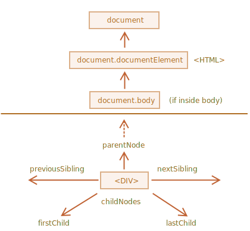

# Bootcamp Notes
## Fundamental Javascript
## Javascript 
JavaScript is a programming language that allows programmers to implement complex features on web pages — every time a web page does more than just sit there and display static information for you to look at — displaying timely content updates, interactive maps, animated 2D/3D graphics, scrolling video jukeboxes, etc. 

## JavaScript engine
-	Converts human readable codes into machine code without producing intermediate codes
-	Many of the JavaScript engine to date are JIT compilers (just in time compilers) that produce in time translation and optimisation 

## Console windows/ interfaces
- Allow to input commands and view outputs
- Input commands to console, taken live to JavaScript JIT engine compiled, processed and presented viewing the outputs of the commands delivered into human readable format texts 
- useful in debugging and reviewing any errors in inputting codes and highlight in the Console window
- Consoles are opened in common developer tools

## Console.log
Console.log is a function that prints message that exits in the Javascript engine
- it is particularly impprtant to test whether the code is functioning as intended

## Variables 
(Noun) in Javascript in the following forms:
- numbers  (1)
- strings ("string")
- Booleans (true, false)
etc.

## Arithmetic operators
- +(addition)
- -(subtraction)
- *(multiplication)
- /(division)

## Modulo Remainder
- Remainder operator(%) 
returns the remainder left over when one operand is divided by a second operand

## Assignment Operator
- Equality operators (=, ==, === strictly equality,!=== strict inequality )
- Comparison operators (>, <)

## Logical Operator
- || (or), && (and), ! (not)

## Array (arr)
- Single variable to store multiple elements (list of elements)
- simple to access particular element / variable later on 
 e.g. <code>var string = [1,2,3,,4,5,6];</code>
### Member access in arr
- start from 0 to the arr length - 1 (as starts from 0)  
e.g. <code>var string = [1,2,3,,4,5,6];  string[0] // print 1//
   </code>

## for loop
Control flow statement
for specifying iteration, which allows code to be executed repeatedly. A for 
loop has two parts: a headerspecifying the iteration, and a body
which is executed once per iteration.
 e.g. <code>
var string = [apple,pear,orrange,avocado,strawberry];  
for (var i = 0; i < string.length; i++) {  
   console.log string[i];  
} // print apple,pear,orrange,avocado,strawberry
</code>

## Alerts, Confirms and Prompts (text pop up or fill-in)
Alerts
<code>alert("Hello! I am an alert box!!");</code> 
Confirms
<code>confirm("Would you like to code");</code>//return true or false in string form (confirm/cancel) 
Prompts
<code>
function myFunction() {
let person = prompt("Please enter your name", "Harry Potter");
  if (person != null) {
    document.getElementById("demo").innerHTML =
    "Hello " + person + "! How are you today?";}</code> 
//return as string  
Important to parseInt* to return as number from string

## if else statement
The if...else statement executes a statement if a specified condition is true. If the condition is false, another statement in the optional else clause will be executed.
 <code>function testNum(a) { 
  let result; 
  if (a > 0) { 
    result = 'positive'; 
  } else { 
    result = 'NOT positive'; 
  } 
  return result; 
} 

console.log(testNum(-5));
// expected output: "NOT positive"
</code>

## switch statement (simplified for multiple conditions)
The switch statement evaluates an expression, matching the expression's value against a series of case clauses, and executes statements after the first case clause with a matching value, until a break statement is encountered. The default clause of a switch statement will be shown if no case matches the expression's value.

<code> 
const expr = 'Papayas'; 
switch (expr) { 
  case 'Oranges': 
    console.log('Oranges are $0.59 a pound.'); 
    break; 
  case 'Mangoes': 
  case 'Papayas': 
    console.log('Mangoes and papayas are $2.79 a pound.'); 
    // expected output: "Mangoes and papayas are $2.79 a pound." 
    break; 
  default: 
    console.log(`Sorry, we are out of ${expr}.`);  //ES6
}
</code>

## while loop
While loop execute a specified statement upon evaluating the condition to be true.
  <b>*Main difference between for loop and while loop</b>
  While loop executes the statement until there is a break condition (usually using if statements) / when the condition returned to be false
  for loop uses incrementation with the definite length
  e.g. 
  <code>let n = 0;

while (n < 3) {
  n++;  // looping though 1 - 3 and then returned n = 3

}

console.log(n);
// expected output: 3</code>

## Object
- Object literal 
JavaScript is designed on a simple object-based paradigm. An object is a collection of properties, and a property is an association between a name (or key) and a value. A property's value can be a function, in which case the property is known as a method.

Objects in JavaScript, just as in many other programming languages, can be compared to objects in real life. In JavaScript, an object is a standalone entity, with properties and type. Compare it with a cup, for example. A cup is an object, with properties. A cup has a color, a design, weight, a material it is made of, etc. The same way, JavaScript objects can have properties, which define their characteristics.

In addition to objects that are predefined in the browser, you can define your own objects. This chapter describes how to use objects, properties, and methods, and how to create your own objects.
- Key-value pairs
Unique identifier for accessing particular member value. In objects, key-value pairs define the properties of an object

<h2><u>Maserati MC20 Cielo</u></h2>

<code>
var maseratiMc20 = {

  engine :'v6', //key and value pairs 

  maxTorque : '730 Nm',

  maxSpeed : '>325 km/h',

}

//keys: engine, maxTorque, maxSpeed
//values: 'v6', '730 Nm', '>325 km/h'
</code>

## Method
Built in Named pieces of code with built in functions.
And in Window object, Console preview, contains of many functions (methods) set up by JIT compilers 
eg. -console.log -Math.random()
- Obj Method s
1. Object.keys()
Object.keys() returns an array iterate object that contains the keys of object
If you need the property values, use Object.values() instead. If you need both the property keys and values, use Object.entries() instead. 
<code>
const object1 = { 
  
   a: 'somestring',

    b: 42,

    c: false

    };

    console.log(Object.keys(object1));

    var arr = Object.keys(object1);

    console.log(arr[0]);

    for (var i = 0; i < arr.length; i++) {

      console.log(arr[i]);

    }
</code>
 

2. Object.values() 
Object.values() returns an array of values of the object

    <code>
    var maseratiMc20 = {

    engine :'v6',//key and value pairs 

    maxTorque : '730 Nm',

    maxSpeed : '>325 km/h',
    
    }
    var arrMc20 = Object.values(maseratiMc20);

    console.log(arrMc20);

    //return in console Array(3)

    arrMc20 = ['v6', '730 Nm', '>325 km/h'];
    
    </code>

3. Object.entries() 
Object.entries() returns an array of values of the object

    <code>
    var maseratiMc20 = {

    engine :'v6', //key and value pairs 

    maxTorque : '730 Nm',

    maxSpeed : '>325 km/h',
    
    }
    var arrMc20En = Object.entries(maseratiMc20);

    console.log(arrMc20En);

    //return in console Array(3)

   [
    [
        "engine",
        "v6"
    ],
    [
        "maxTorque",
        "730 Nm"
    ],
    [
        "maxSpeed",
        ">325 km/h"
    ]
]
    
    </code>

4.  parseInt Method
parseInt method is used to parse in strings(''/ "") into integers
 e.g.
<code>
</code>

## Nested data structure
A robust data structure is important to maintain function in multiple settings so that code inside can be easily updated  
There are different examples of nested data structures
- Arr of Arr
- Obj of Obj
- Arr of Obj
- Obj of Arr

## Composition
Simplified hierachy system created by compositioning - Javascript objects are integrated together from large complex objects into simpler objects which produce code that is more reusable, clean and provide better solution.

## Function
Block of code designed to perform particular task and it is executed when fucntion is called or invoked

- Function declaration
indicate by named function 
* particularly useful especially create on the global scope and be accessible throughout the code
<code>
function drive() {

  //function block;

  return;

}
</code>

- Function expression
Assign variable a function 
<code>
var drive = function() {

  //function block;

  return;

}
</code>
Assignment operator = we use function followed by {}

- Callback function
Callback function is usually passed into another function asynchronously  as an arguement to invoke a planned response - awaits for results generated from a synchronous function then complete the routine / action intended

## Parameters and Logic
Parameters allows to pass values into function by providing a name, values are then assigned when the function is being called/ invoked.
<code>
function greet(firstName) {

  console.log("Hello, " + firstName);

  return;

}
c
greet('Harry');
</code>

## Scope and Shadowing
Scope refers to the current context of scope that determines the accessibility of variables declared.
- Global Scope
Variables are accessible globally outside of block
- Local Scope
Variables are accessible locally inside of block
- Variable shadowing
Declaring a variable in certain scope and reassign values in another level of scope
The variable assigned within an inner scope shadows the outer variable assigned in the outer scope.

## This keyword
This is a keyword that always refer to an object and it can be referred to different values depends on the context. - window object, function, class or global.
  e.g. 
<code>
// this is refer to the global object

console.log(this);

// this is refer to the window object

function helloThis() {

  console.log('Inside this function, this is ' + this);

}

helloThis ();

// this is refer to the variable child object and refer to age:10 (property)

var child = {

  age: 10,

  ageTenYears: function () {

   console.log(this.age + 10);

  },

};

child.ageTenYears();

// this is refer to the variable investor and call property initial investment and multiply

var investor = {

  name: 'Cash Saver',

  investment: {

  initialInvestment: 5000,

  investmentGrowth: function () {

   console.log(this.initialInvestment * 1.15);

  },

  },

};

investor.investment.investmentGrowth();
</code>

## Array Methods
Method is an object that contains function value
### .sort()
sort() method is used to sort arr items into alphabetical order 
  e.g. 
<code>

const months = ['March', 'Jan', 'Feb', 'Dec'];

months.sort();

console.log(months);

// expected output: Array ["Dec", "Feb", "Jan", "March"]
</code>

### .push()
push() method is used to add one or more element(s) at the end of an array to the *original array
  e.g. 
<code>const arr1 = ['Moon', 'Sun', 'Mars'];

const space = arr1.push('Jupiter'); 
; // expected to be arr1 =['Moon', 'Sun', 'Mars', 'Jupiter'];

conaole.log(space); // expected to return as 4;
</code>

### .slice(start,end)
slice() method is used to slice and returns a portion of array into a new array object (passing in arguements of the start and end of slice)
 *require to store in a new varible, const
  e.g. 
<code>
	var animals = ['ant', 'bison', 'camel', 'duck', 'elephant'];
	var animalSlice = animals.slice(2);

  console.log(animals); // expected to return as ["ant",	"bison",	"camel",	"duck",	"elephant]
  console.log(animalSlice); //expected to return as ["camel",	"duck",	"elephant"]
</code>

### replace (pattern, replacement)
Returns a new string with part or all matches of a pattern replaced by a replacement
  e.g. 
<code>
Syntax

replace(pattern, replacement);

### .find()
Returns the first element element of array that satisfied the testing function. If no value satisfy the testing function, the nethod return undefined
  e.g. 
var numbers = [2, 4, 6, 8, 10, 12]; 

var planets = [ 
  {
      name: 'Earth',
      moons: 1
  }, 
  {
      name: 'Mars',
      moons: 2
  }, 
  {
      name: 'Jupiter',
      moons: 79
  }, 
  {
      name: 'Saturn',
      moons: 82
  } 
]; 

// Filtering Methods 

// Find - return as object 
console.log(numbers.find(function(i) { 
  return i > 10 
})) 

console.log(planets.find(function(i) { 
  return i.moons > 10 
})) 
//expected return as {"name": "Jupiter", "moons": 79} prototype: object
</code>

### .filter()
.filter method creates a shallow copy of portion of given array and filtered to only elements from the given array that pass the parameter of testing function

<code>
// Find - return as array 
console.log(numbers.filter(function(i) { 
  return i >= 10 
})) 
//expected to return as arr(2) [10,12] prototype: Array 

console.log(planets.filter(function(i) { 
  return i.moons > 10 
})) 
//expected to return as arr(2)
[
    {
        "name": "Jupiter",
        "moons": 79
    },
    {
        "name": "Saturn",
        "moons": 82
    }
]
</code>

## String methods
Apart from array methods, string methods also provide in-built methods to manipulate strings.

## Iterative methods
### .forEach()
forEach method is used as a call-back function that accepts up to 3 arguements, that executes a provided function once for each array element
- value
- index
- arr

 e.g. 
<code> 
const numbers = [1, 2, 3, 4, 5];

*forEach function
function consoleItem (item), index, arr) {

  console.log(item);

  // expected to return 1 2 3 4 5

}

  
*Arrow function

numbers.forEach((item, index, arr) => {

  console.log('a['+ index +'] = ' + item);

  // expected to return a[0] = 1 a[1] = 2 a[2] = 3 a[3] = 4 a[4] = 5

}); 

 
*Sum function using forEach method

numbers.forEach(item => {

  sum += item;

});
 
console.log(sum);

  function to check frequency

const letters = ['a','b','c','d','e','a','b'];

let count = {};

letters.forEach (item => { 
  if (count[item]) { 
    count[item]++; 
  } else { 
    count[item] = 1; 
  }

});

console.log(count);
</code>

### .map()
creates a new array populated with the results of calling a provided function on every element in the calling array

 e.g. 
<code>
const items = [ 
  { name: 'TV', price: 200}, 
  { name: 'PC', price: 2000}, 
  { name: 'phone', price: 1000}, 
  { name: 'Bike', price: 100}, 
} 

const itemNames = items.map(item) => { 
  return item.name 
}); 
console.log(itemNames); 
//expect to return arr(4)['TV', 'PC', 'phone', 'Bike'] length: 4

</code>

## API
Application Programming Interface
- provide a way for creating user code that utilises pre-built code to conduct various tasks.
- e.g. web APIs, third party APIs

## Web browser
Web browser is the most common programme (user agent) used to retrieve and display pages from web server
Every webpage, img and videos on web can be accessed via specific unifrom resource locator (URL)

## DOM manipulation
Document Object Model (abbreviated as DOM) 
DOM is referred to be tree objects/ nodes that is created by the web browser
- each node contains its own properties/ methods
- It can be manipulated by using Javascript

### In-built DOM methods
<b>Examples</b>
 <code> 
document.domain //domain name  
document.URL //URL location  
document.title //title of the HTML document  
document.head //targeting head of the HTML  
document.body //targeting body of the HTML 
document.all[index] //targeting specific child Node of the document 
docuement.all[5].textContent = '' //targeting the sixth child Node of the HTML document and changing text content into given text 
document.images 
document.links 
*these methods could be of disadvantage for maintainence as index of child Node can change due to ammendments  
</code>

### Parent Child Relationship
 
Parent Child is commonly used in the reference of Tree and Nodes of document. 
Parent is an object that contains more than one children (Node)
Child(Node) can also contain children

### DOM traversal
DOM traversal is referred to be working down the DOM tree from targeting particular parent element to passing into the specific child element to make ammendments with different directions

<h3>Downwards </h3>
<code>

- document.querySelector

- document.querySelectorAll('p')// targeting all paragraph tags
- document.children //targeting the specific HTML elements that is the direct child of the tree
- document.getElementbyId('id-name') //targeting particular elements with specific id-name
- document.getElementbyClassName
// targeting particular elements with specific class name
- document.getElementbyTagName('li').style.color = "white"; // targeting list item to amend color style
- function myFunction() {

  document.getElementById("myH1").setAttribute("class", "democlass"); 
  
  }
  
  .demoClass{color:red};// setAttribute method require 2 parameters first (CSS styles) second (attribute value)
- further example for setAttribute
    site2El.children[0].textContent = "Site 2";
    site2El.children[1].setAttribute("href", "https://twitter.com");
    site2El.children[1].children[0].setAttribute("src", "assets/images/image_2.jpg");
    site2El.children[1].children[0].setAttribute("alt", "group brainstorm");
    site2El.children[1].children[0].setAttribute("style", "padding:10px;");

  </code>

<h3> Upwards </h3>
<code>

- document.parentElement // return specific parent element of the directed element
</code>

<h4>Create and Append</h4>
createElement() creates a Node element and appendChild append the created Node element into the child of the body 
<code>

- var header = document.getElementById('header').createElement('h1'); 
document.body.appendChild(header);
- document.createTextNode('hello world');
</code>

<h3> Same level</h3>
<code>

- element.nextElementSibling // return the next element that is the same level in parent tree
- element.previousElementSibling // return the previous element that is the same level in parent tree
</code>

<h3>Timer and Intervals</h3>
example 
<code>
// Selects element by class
var timeEl = document.querySelector(".time");

// Selects element by id
var mainEl = document.getElementById("main");

var secondsLeft = 10;

function setTime() {
  // Sets interval in variable
  var timerInterval = setInterval(function() {
    secondsLeft--;
    timeEl.textContent = secondsLeft + " seconds left till colorsplosion.";

  if(secondsLeft === 0) {
      // Stops execution of action at set interval
      clearInterval(timerInterval);
      // Calls function to create and append image
      sendMessage();
    }

  }, 1000);
}

// Function to create and append colorsplosion image
function sendMessage() {
  timeEl.textContent = " ";
  var imgEl = document.createElement("img");
  imgEl.setAttribute("src", "images/image_1.jpg");
  mainEl.appendChild(imgEl);

}

setTime();

</code>

<h2> Events </h2>

### addEventListener()
addEventListener() is a method that attaches event handler to specified element
- addEventListener() contains 2 parameters: event and action 
It is useful when used together with a callback function triggered by the specific event target
- event targets are element, or children of Node, document and window object

e.g.  
<code>
document.getElementById("myBtn").addEventListener("click", myFunction);

function myFunction() {
  alert ("Hello World!");
}
</code>

### event.preventDefault()
In Javascript there are some default behaviours in certain elements. event.preventDefault() prevents the occurence of the default actions.

e.g. 
<code>
const form = document.getElementById('form')

form.addEventListener('submit', (event) => {
  event.preventDefault()
  
  // process data and submit a request 

  // prevent default action of form 
})
</code>

### KeyboardEvent.key

keydown event

### event.stopPropagation()
event.stopPropagation() is a method to prevent the spreading of events when an event is triggered on an element
- In Javascript when an event is triggered on an element 

e.g.  
<code>
var outer = document.querySelector(".outer-div");
var inner = document.querySelector(".inner-div");
var button = document.querySelector(".button");

function changeBlue(event) {
  event.stopPropagation();
  event.currentTarget.setAttribute(
    "style",
    "background-color: blue"
  );
}

function changePurple(event) {
  event.stopPropagation();
  event.currentTarget.setAttribute(
    "style",
    "background-color: #601A4A"
  );
}

function changeOrange(event) {
  event.stopPropagation();
  event.currentTarget.setAttribute(
    "style",
    "background-color: #EE442F; color: white;"
  );
}
</code>

### event.target()
event.target indicates the element slected and is used usually for event delegation

<code>
var container = document.querySelector(".container");

container.addEventListener("click", function(event) {

  var element = event.target;

  console.log(element);

  if (element.matches(".box")) {

  var state = element.getAttribute("data-state");

  element.textContent = element.dataset.number;

  element.dataset.state ="visible";

  } else {

  element.textContent = "";

  element.setAttribute= ("data-state", "hidden");

  };

});

</code>

### Data attributes
Data attributes are used to store extra information related to the elements in HTML, without the use of extra DOM properties.

- We use data- to start the name of any element that is 
a data attribute

<code>

//article tag

  id="electric-cars"

  data-columns="3"

  data-index-number="12314"

  data-parent="cars"

//script js accessing values stored in data attributes
var columns = $('#electric-cars').dataset.columns.textContent); 

var parent = $('#electric-cars').getAttribute('data-parent');

</code>

## Client Side Storage

Window.localStorage is a property of window interface allowing to access Storage object for the docuemnt's origin. Stored data and Items are added and stored in the browser with key/value pairs

Web API client-side storage enables to store data and manipulate it via Javascript
- setItem()
- getItem()
Local Storage only store elements in strings
and should not be in form of objects
- conversion of objects into strings
JSON.stringify() together with setItem()
- conversion of strings to objects 
JSON.parse() together with getItem()
when string is converted back to an object
values stored in localStorage can be easily accessed using the dot notation
 e.g.

<code>
userFirstNameSpan.textContent = lastUser.firstName;

userEmailSpan.textContent = lastUser.email;
</code>

Example for memo 
<code>
var todoInput = document.querySelector("#todo-text");
var todoForm = document.querySelector("#todo-form");
var todoList = document.querySelector("#todo-list");
var todoCountSpan = document.querySelector("#todo-count");

var todos = [];

renderTodos();

function init() {
  var storedTodos = JSON.parse(localStorage.getItem('todos'));

  if (storedTodos !== null){
    todos = storedTodos;
  }

}

function renderTodos() {
  // Clear todoList element and update todoCountSpan
  todoList.innerHTML = "";
  todoCountSpan.textContent = todos.length;

  // Render a new li for each todo
  for (var i = 0; i < todos.length; i++) {
    var todo = todos[i];

  var li = document.createElement("li");
  li.textContent = todo;
  li.setAttribute("data-index", i);
  todoList.appendChild(li);

  var button =document.createElement('button');
  button.textContent = "Complete";
  li.appendChild(button);
  }
}

// When form is submitted...
todoForm.addEventListener("submit", function(event) {
  event.preventDefault();

  var todoText = todoInput.value.trim();

  // Return from function early if submitted todoText is blank
  if (todoText === "") {
    return;
  }

  // Add new todoText to todos array, clear the input
  todos.push(todoText);
  todoInput.value = "";

  // Re-render the list
  storeTodos();
  renderTodos();
});

function storeTodos (){
  localStorage.setItem("todos", JSON.stringify(todos));
}

todoList.addEventListener('click', function(event){
  var element = event.target;
  console.log(element);
  if (element.matches('button') === true){
    var index = element.parentElement.getAttribute('data-index');
    todos.splice(index, 1);
    
  renderTodos();
  }
})

</code>

## API Key & importance of its access
API key is used by multiple web APIs, that provide access control (for identification).
API key usually is related to the identification of API user also different rights (i.e.quota and authorisation area) that are open for access to the key
- applies to HTTPS for example

## Query String
General thumb of rule in URL:
protocal (HTTP/ HTTPS), location of file/ program (in form of host-name/ file-name) and query string

- length limitation
Try to limit the length of query strength (depends on the server ability to handle MAX 2000)
> The HTTP protocol does not place any a priori limit on the length of
   a URI. Servers MUST be able to handle the URI of any resource they
   serve, and SHOULD be able to handle URIs of unbounded length if they
   provide GET-based forms that could generate such URIs. A server
   SHOULD return <b>414 (Request-URI Too Long) status</b> if a URI is longer
   than the server can handle (see section 10.4.15).

## Use of API Key (with examples)

<code>
//use of concatanation to clean code  
var apiKey = 'trilogy';  
var queryURL = "https://www.omdbapi.com/?t=dune&y=&plot=short&apikey=" + apiKey;
</code>

## API endpoint
APi endpoint is
Specific digital location where that allows communication and connections between sofeware programs (via exchange of code)
- requests for information are sent by one program to retrieve pre-existing digital resource 

>Sending request for information from web application/ server ➡ Receive response 

<b>Example : Instagram</b>

- business and creators endpoint that measure media and profile interactions
- moderation endpoint that regulate comments and replies
- discovery of hashtagged media 
etc.

## JSON
JavaScript Object Notation
it is a common format that data will be presented via an API.

## AJAX
Asynchronous JavaScript And XML. It is nota programming language but rather a technology  
It allows us to update web pages by exchanging data with a web server, without reloading the page

### .then() function

## Break into pieces
User input -> response -> output

